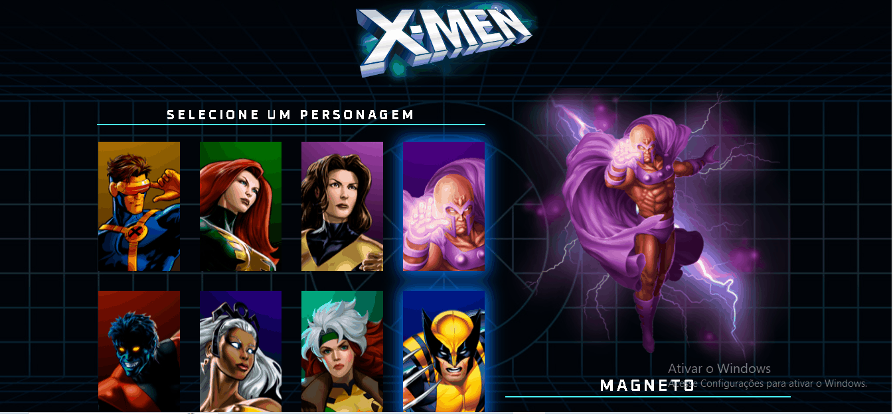

# Projeto X-MEN🎮

## Descrição:

É um projeto de seleção de personagens da famosa equipe X-MEN.
Os X-MEN são mutantes: humanos que, como resultado de um súbito salto evolucionário, nasceram com habilidades super-humanas latentes, que geralmente se manifestam na puberdade.

[]

## Tecnologias Utilizadas👨‍💻:

- HTML;

- CSS;

- JavaScript.